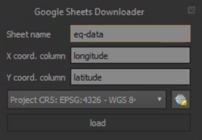
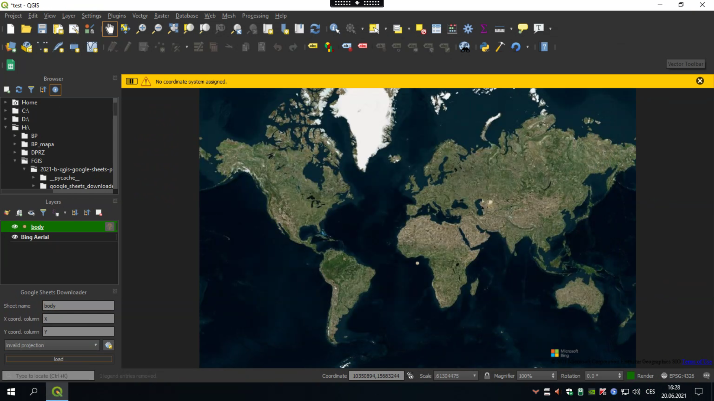

GoogleSheetsDownloader plugin documentation
============================================
The GoogleSheetsDownloader plugin allows downloading data saved in Google Sheets and add them to the QGIS Project as a point layer.
The plugin was created as a semester project for the subject 155FGIS on CTU Prague.

How to install the plugin
------------------
1. Download plugin as a zip file from the GitHub repository.
2. Open "Manage and install plugins..." in your QGIS a select "Install from zip"

.. image:: images/install.PNG
   :width: 500

3. Find your file in the file viewer and press "Install plugin"
4. After the installing this icon will be added

.. image:: images/icon.png

5. Open OSGeo4W Shell and install library for accessing the GDrive API

   pip install --upgrade google-api-python-client google-auth-httplib2 google-auth-oauthlib

How to work with the plugin
------------------
1. After clicking on the plugin icon, the plugin will start

.. image:: images/plugin_empty.PNG

2. Fill in the table name, name of the columns with X and Y coordinate and select CRS

:align: right

3. After clicking on load, it is necessary to log in to your GDrive account and enable all the permissions
(plugin is in the experimental mode, if you want to try it, you must contact creators to add your Google Account to the app)

.. image:: images/authorization.PNG
   :width: 45%

4. Then your table data will be added to the current QGIS project

.. image:: images/map+points.PNG
------------------

Possible errors
------------------
* No such file "..." located on your Google Drive account.
Possible problem: 
  The sheet's name was filled incorrectly or wasn't filled.

.. image:: images/error_no_such_file.PNG

* Invalid coordinate columns parameters.
Possible problem: 
   Incorrect or no name of the column was filled.

.. image:: images/error_invalid_column_parametres.PNG

* No coordinate system assigned.
Possible problem: 
   Any coordinate reference system wasn't selected.

Authors
------------------
* Marek Hoffmann
* Monika Křížová

 `155FGIS - Free software GIS <https://geo.fsv.cvut.cz/gwiki/155FGIS_Free_software_GIS>`_, CTU Prague, 2021

Supervisor: Ing. Martin Landa, Ph.D.

Contents:

.. toctree::
   :maxdepth: 2

Indices and tables
==================

* :ref:`genindex`
* :ref:`modindex`
* :ref:`search`
