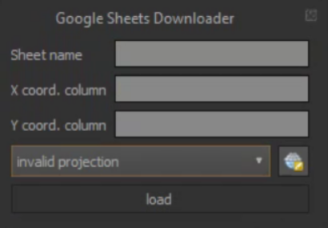
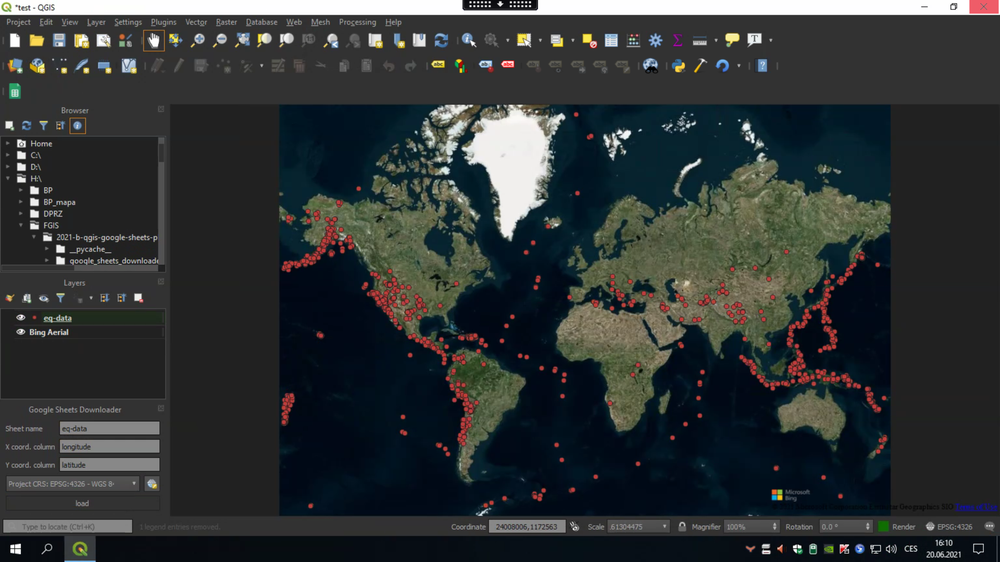

GoogleSheetsDownloader plugin documentation
============================================
The GoogleSheetsDownloader plugin allows to download data saved in Google Sheets and add them to the QGIS Project as a point layer.
The plugin was created as a semester project for the subject 155FGIS on CTU Prague.

How to install the plugin
------------------
1. Download plugin as a zip file from the GitHub repository.
2. Open "Manage and install plugins..." in your QGIS a select "Install from zip"

.. image:: images/install.PNG
   :width: 500

3. Find your file in the file viewer and press "Install plugin"
4. After the installing this icon will be added

How to work with the plugin
==================
1. After clicking on the plugin icon, the plugin will start

2. Fill table name, name of the columns with X and Y coordinate and select CRS

.. image:: images/plugin_filled.PNG

3. After clicking on load, it is necessary to log in to your GDrive account and enable all the permissions
(plugin is in the experimental mode, if you want to try it, you must contact creators to add your Google Account to the google API)

.. image:: images/authorization2.PNG
   :width: 45%

4. Then your sheets data will be added to the current QGIS project

Contents:

.. toctree::
   :maxdepth: 2

Indices and tables
==================

* :ref:`genindex`
* :ref:`modindex`
* :ref:`search`
